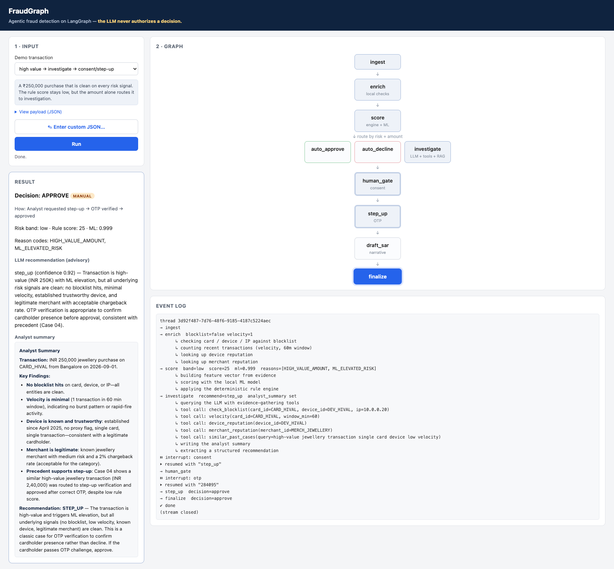
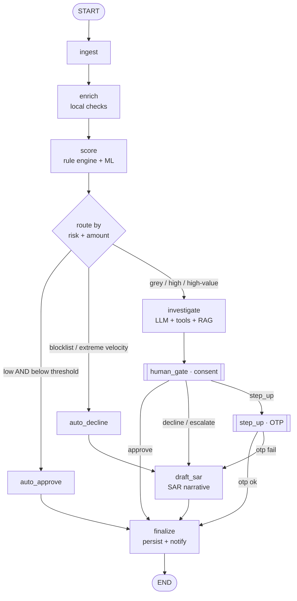
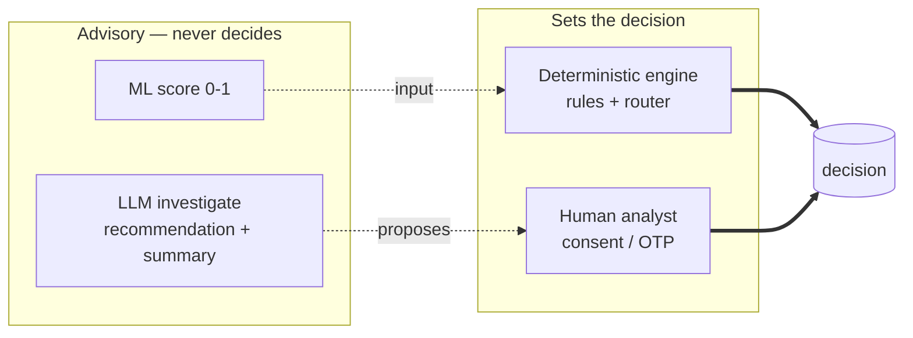

# FraudGraph

A local-first, agentic fraud-detection demo on **LangGraph**.

> ## The one principle: **the LLM never authorizes a decision.**
> A deterministic engine or a human sets the decision. The LLM and the ML model
> only gather evidence, score, and explain. This boundary is enforced in code
> (a guard raises if any LLM node writes `decision`).

Everything runs on your machine — the graph, the ML model, the databases, the
vector store, the checkpointer, and the web app. Only two things leave the
machine: **LLM API calls** and **email**.



---

## The decision graph



The two double-bordered nodes (`human_gate`, `step_up`) are `interrupt()` pause
points — the graph suspends to disk and resumes when a human responds.

## Who has authority



---

## Setup

```bash
uv sync --extra dev                              # deps (Python 3.12, via uv)
cp .env.example .env                             # add API keys + email creds
uv run python -m fraudgraph.data.seed            # build data/fraud_demo.db from committed seeds
uv run python -m fraudgraph.scoring.train_model  # train + save data/model.pkl (AUC ~0.998)
uv run python -m fraudgraph.rag.index            # build the Chroma index (downloads MiniLM once)
uv run pytest                                    # 41 tests
```

> `brew install libomp` enables XGBoost; without it the trainer falls back to
> scikit-learn logistic regression. Phases 4+ call the LLM (Anthropic/OpenAI per
> `.env`); the deterministic paths and all lookups run with no API key.

## Run it

```bash
# CLI — prints each node + sub-steps, prompts for consent/OTP at the pauses
uv run python scripts/run_cli.py --txn demo/transactions/velocity.json

# Web app — watch nodes light up, approve/step-up in the browser
uv run uvicorn app.server:app --host 127.0.0.1 --port 8000   # http://localhost:8000
```

Four canned demos in [`demo/transactions/`](demo/README.md): clean (auto-approve),
blocklist (auto-decline), velocity (investigate → consent), high-value
(investigate → step-up → OTP).

---

## From this demo to AWS production

The whole thing maps cleanly onto managed AWS services, with the governance
boundary preserved:

| This demo (local) | AWS production | Role |
|---|---|---|
| Rule engine + router (LangGraph) | **Step Functions** | The governed, auditable decision path |
| `model.pkl` (XGBoost) | **SageMaker** endpoint | Sub-ms ML risk score |
| Velocity / device / merchant lookups (SQLite/DuckDB) | **DynamoDB** + **SageMaker Feature Store** | Real-time features |
| Investigate + SAR LLM (Anthropic/OpenAI) | **Amazon Bedrock** | Narration & recommendation (advisory) |
| RAG over cases/policies (Chroma + MiniLM) | **OpenSearch** / **Bedrock Knowledge Bases** | Precedent retrieval |
| OTP + escalation email (SMTP) | **Amazon SES** | Notifications |
| Checkpointer (`AsyncSqliteSaver`) | Step Functions state + **DynamoDB** | Durable pause/resume |
| Observability (LangSmith) | **CloudWatch** / X-Ray | Tracing |
| — | **PrivateLink** + in-region deploy | Data residency (e.g. RBI localization) |

The critical property survives the port: **the decision is set by Step Functions
(deterministic) or a human, never by Bedrock.**

---

## Layout

```
src/fraudgraph/   config · data · scoring · rag · llm · graph · messenger · notifications
app/              FastAPI server + static frontend
scripts/          run_cli.py
tests/            41 tests
data/seed/        committed CSV seeds, cases, policies
demo/             canned demo transactions
```

See [`TALK_TRACK.md`](TALK_TRACK.md) for the one-page narration, and
[`context/fraud-graph-build-plan.md`](context/fraud-graph-build-plan.md) for the
phase-by-phase build plan.
