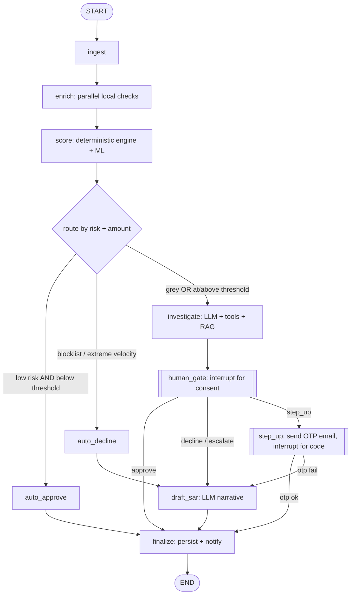

# FraudGraph — Build Plan

A local-first agentic fraud-detection demo on LangGraph, built phase by phase with Claude Code. Governance rule of the whole system: **the LLM never authorizes a decision.** A deterministic engine or a human sets the decision; the LLM only gathers evidence and explains.

---

## 0. Locked decisions

| Choice | Decision | Why |
|---|---|---|
| Orchestration | LangGraph (`StateGraph`, conditional edges, `interrupt()`, `AsyncSqliteSaver`) | Typed state, native human-in-the-loop, durable resume |
| LLMs | Anthropic + OpenAI via LangChain bindings, small/fast models, swappable | You have credits; provider flip is a nice demo moment |
| Local ML score | scikit-learn / XGBoost, trained offline, loaded from `model.pkl` | Tiny (a few MB), sub-ms, runs in <1GB |
| RAG | Chroma + `all-MiniLM-L6-v2` local embeddings | Fully local, ~90MB, no API needed for retrieval |
| Data | SQLite (reference + txns) + DuckDB optional for velocity windows | Zero-setup, single file, ships with Python |
| Persistence | `AsyncSqliteSaver` checkpointer | Pause a case, resume later from disk |
| Email / OTP | your `messenger.send_email(subject, text, html)` wrapped in `notifications.py` | Reuse what you already have |
| UI | FastAPI + WebSocket + thin static frontend (vanilla JS) | Streams node-by-node, pauses for input, resumes |
| Deep agents | Not used | Wrong tool for a governed decision path; kept out on purpose |
| Env / Python | `uv`, Python 3.12 | Matches your existing setup |

**What runs locally vs. leaves the machine:** local = graph, ML score, DBs, vector store, checkpointer, web app. Leaves the machine = LLM API calls + SendGrid email. Nothing else.

---

## 1. Repo structure (target end state)

```
fraud-graph/
├── .env.example
├── pyproject.toml
├── README.md
├── data/                      # all generated, gitignored
│   ├── seed/                  # csv seeds committed
│   ├── fraud_demo.db          # sqlite (generated)
│   ├── chroma/                # vector store (generated)
│   └── checkpoints.db         # langgraph checkpointer (generated)
├── src/fraudgraph/
│   ├── config.py              # thresholds, band cutoffs, model names, paths
│   ├── data/
│   │   ├── generate.py        # synthetic transaction + reference data
│   │   ├── seed.py            # create + load sqlite tables
│   │   └── db.py              # lookups: blocklist, velocity, device/ip rep, merchant rep
│   ├── scoring/
│   │   ├── features.py        # evidence -> feature vector
│   │   ├── rules.py           # deterministic rule score + reason codes
│   │   ├── model.py           # load + predict tiny ML model
│   │   └── train_model.py     # train + save model.pkl
│   ├── rag/
│   │   ├── index.py           # build chroma index from cases + policies
│   │   └── retriever.py       # similar_past_cases()
│   ├── llm/
│   │   ├── factory.py         # get_model(provider) -> chat model
│   │   └── prompts.py
│   ├── graph/
│   │   ├── state.py           # FraudState
│   │   ├── tools.py           # @tool wrappers over db.py + rag
│   │   ├── nodes.py           # node functions
│   │   ├── router.py          # routing function(s)
│   │   └── build.py           # build_graph() -> compiled graph + checkpointer
│   ├── notifications.py       # wraps messenger.send_email + otp helpers
│   └── messenger.py           # YOUR module (drop in)
├── app/
│   ├── server.py              # FastAPI + websocket
│   └── static/ (index.html, app.js, styles.css)
├── scripts/run_cli.py         # run graph on a txn, print the path (phase 3–5 testing)
├── tests/ (test_db.py, test_scoring.py, test_router.py)
└── demo/transactions/         # canned demo inputs
```

---

## 2. The state contract (freeze this early — everything depends on it)

```python
from typing import TypedDict, Annotated
from langgraph.graph.message import add_messages

class FraudState(TypedDict):
    transaction: dict          # amount, card_id, device_id, ip, merchant_id, ts, geo, user_email
    evidence: dict             # filled by enrich: blocklist_hit, velocity, device_rep, merchant_rep, ...
    rule_score: float          # 0–100, set by the deterministic engine ONLY
    ml_score: float            # 0–1 from local model (optional input to rule_score)
    risk_band: str             # "low" | "grey" | "high"
    decision: str              # approve | decline | hold | step_up | escalate — set by engine or human ONLY
    reasons: list[str]         # machine reason codes
    analyst_summary: str       # LLM narration (never a decision)
    sar_draft: str             # LLM case note, grounded in evidence
    otp_ok: bool               # result of step-up
    human_decision: str        # set after interrupt()
    messages: Annotated[list, add_messages]
```

**Invariant to enforce in code:** `decision` is only ever written by the `score` node, the `human_gate`, or the `step_up` result. No LLM node writes `decision`. Add an assertion/guard so this can't drift.

---

## 3. The graph (the contract the frontend renders)



Two pause points (`[[double-bordered]]`): `human_gate` (consent buttons) and `step_up` (OTP box). Both are `interrupt()`.

---

## 4. Config knobs (put in `config.py`, don't hardcode)

- `HIGH_VALUE_THRESHOLD` — e.g. ₹50,000 (or your currency). The amount branch.
- Band cutoffs on the 0–100 rule score: `LOW_MAX = 30`, `GREY_MAX = 70` (above = high).
- Velocity: `VELOCITY_WINDOW_MIN = 60`, `VELOCITY_MAX_TXNS = 5`.
- `LLM_PROVIDER = "anthropic" | "openai"`, plus the model name for each.
- OTP: `OTP_TTL_SEC = 300`, `OTP_LENGTH = 6`.
- Paths for the three generated files.

---

## 5. Environment (`.env.example`)

```
LLM_PROVIDER=anthropic
ANTHROPIC_API_KEY=
ANTHROPIC_MODEL=            # a small fast Claude model
OPENAI_API_KEY=
OPENAI_MODEL=              # a small fast OpenAI model
SENDGRID_API_KEY=          # whatever messenger.py needs
FROM_EMAIL=
DEMO_USER_EMAIL=           # where OTP + result emails go in the demo
```

---

# Phases

Build in order. Do not start a phase until the previous phase's "Done when" passes. Each phase below gives you a **Claude Code brief** you can paste, and a test.

---

## Phase 0 — Scaffold

**Goal:** empty but runnable project, deps installed, config + env in place.

**Claude Code brief:**
> Create a Python 3.12 project managed with `uv` named `fraud-graph`, using the directory structure I'll paste. Add dependencies: `langgraph`, `langgraph-checkpoint-sqlite`, `langchain-core`, `langchain-anthropic`, `langchain-openai`, `chromadb`, `sentence-transformers`, `scikit-learn`, `xgboost`, `duckdb`, `pandas`, `fastapi`, `uvicorn`, `websockets`, `python-dotenv`, `pytest`. Create `config.py` reading from `.env` with the knobs I'll list, a `.env.example`, a `.gitignore` (ignore `data/*.db`, `data/chroma/`, `.env`), and a `README.md` stub. No logic yet.

**Done when:** `uv run python -c "import langgraph, chromadb, sklearn, fastapi; print('ok')"` prints `ok`, and `config.py` loads the `.env` values.

---

## Phase 1 — Local data layer

**Goal:** synthetic data + SQLite tables + clean lookup functions. No graph, no LLM.

Tables: `transactions`, `cards`, `devices`, `ip_reputation`, `merchants`, `blocklist`. Seed the blocklist with a few known-bad card/device/IP values. Write ~2–3k synthetic transactions (use the Sparkov generator or a simple custom generator; committed CSV seeds in `data/seed/`).

`db.py` functions (each pure, each takes the transaction and returns evidence):
- `check_blocklist(card_id, device_id, ip) -> dict`
- `velocity(card_id, window_min) -> int`
- `device_reputation(device_id) -> dict` (e.g. cards seen on device, proxy flag)
- `merchant_reputation(merchant_id) -> dict`

**Claude Code brief:**
> Implement `data/generate.py`, `data/seed.py`, and `data/db.py`. Generate synthetic payment data (columns: txn_id, card_id, device_id, ip, merchant_id, amount, ts, geo, label). Seed 6 SQLite tables. Write the four lookup functions above with docstrings. Include a couple of deliberately crafted rows: one clean, one blocklisted card, one card with a velocity spike, one high-value grey-zone case. Add `tests/test_db.py` asserting each lookup returns the expected value for those crafted rows.

**Done when:** `uv run pytest tests/test_db.py` passes and you can explain what each lookup does in one sentence.

---

## Phase 2 — Deterministic scoring engine

**Goal:** turn evidence into `rule_score`, `risk_band`, `reasons`. Optionally add the tiny ML model. Still no graph, no LLM.

`rules.py`: transparent, additive scoring (e.g. blocklist hit = +100 → forced high; velocity over limit = +40; bad device rep = +25; etc.), emitting a reason code per rule that fires. Band from cutoffs in config.
`train_model.py` + `model.py`: train an XGBoost/logistic model on the labeled synthetic data, save `model.pkl`, load and predict a 0–1 `ml_score`. The ML score is an *input* to the rule engine, not the decider.

**Claude Code brief:**
> Implement `scoring/features.py` (evidence dict -> feature dict), `scoring/rules.py` (deterministic additive scorer returning score 0–100, band, and a list of reason codes), `scoring/train_model.py` (train on the synthetic labels, save `model.pkl`), and `scoring/model.py` (load + predict). Keep the rules readable and commented so each contribution is explainable. Add `tests/test_scoring.py` asserting the crafted rows land in the expected bands.

**Done when:** the four crafted transactions produce the right bands, and you can read `rules.py` top to bottom and explain every point added.

---

## Phase 3 — LangGraph skeleton (deterministic, no LLM, no UI)

**Goal:** the graph runs end to end on the deterministic path only. Prove threshold routing works with zero LLM calls.

Implement `state.py`, then nodes: `ingest`, `enrich` (calls Phase 1 lookups, fills `evidence`), `score` (calls Phase 2, sets `rule_score`/`risk_band`/`reasons`/`decision` for clear cases), `auto_approve`, `auto_decline`, `finalize`. Implement `router.py` (reads score + amount, returns next node name). Wire with `AsyncSqliteSaver`. For now, `investigate`/`human_gate`/`step_up`/`draft_sar` can be stubs that just pass through to `finalize`.

**Claude Code brief:**
> Implement `graph/state.py`, `graph/router.py`, `graph/nodes.py` (ingest, enrich, score, auto_approve, auto_decline, finalize; stubs for investigate/human_gate/step_up/draft_sar), and `graph/build.py` exposing `build_graph()` that compiles the StateGraph with an `AsyncSqliteSaver` checkpointer. Add `scripts/run_cli.py` that takes a transaction JSON (or a `--default` flag), runs the graph, and prints each node as it executes plus the final decision and reasons. Add `tests/test_router.py`.

**Done when:** running the CLI on each of the four crafted transactions prints a *different, correct* path (clean→approve, blocklist→decline, velocity→investigate-stub, high-value→investigate-stub), fully deterministically.

---

## Phase 4 — LLM investigate node + RAG

**Goal:** on grey/high-value cases the LLM gathers evidence via tools, retrieves similar past cases, and writes a recommendation + `analyst_summary`. It proposes; it does not decide. Add the SAR drafter.

`rag/index.py`: embed ~15–20 past case files + a couple of fraud-policy docs into Chroma with `all-MiniLM-L6-v2`. `rag/retriever.py`: `similar_past_cases(query) -> list`.
`llm/factory.py`: `get_model()` returns a LangChain chat model per `LLM_PROVIDER`, so you can flip Anthropic↔OpenAI from `.env`.
`graph/tools.py`: `@tool` wrappers around the Phase 1 lookups + `similar_past_cases`.
`nodes.investigate`: bind tools to the model, let it call them, then produce a structured recommendation (`recommend: step_up|escalate|decline|approve`, `rationale`, `confidence`) and write `analyst_summary`. Enforce the invariant: it writes `analyst_summary` and a *recommendation*, never `decision`.
`nodes.draft_sar`: LLM writes a narrative grounded strictly in `evidence` (the five W's + how).

**Claude Code brief:**
> Implement `rag/index.py` and `rag/retriever.py` using Chroma + sentence-transformers `all-MiniLM-L6-v2`, seeded from files in `data/seed/cases/` and `data/seed/policies/`. Implement `llm/factory.py` (provider switch), `llm/prompts.py`, `graph/tools.py` (@tool wrappers), and the real `investigate` and `draft_sar` nodes. `investigate` must output a recommendation object and an `analyst_summary` string but must NOT set `decision`. `draft_sar` must ground every sentence in `evidence`. Add a guard in `build.py` that raises if any LLM node sets `decision`.

**Done when:** on a grey/high-value transaction the CLI shows the LLM calling tools, retrieving a similar case, and producing a recommendation + readable summary; the SAR draft names who/what/when/where/why; and the invariant guard is in place.

---

## Phase 5 — Human-in-the-loop + step-up (OTP) + email

**Goal:** the graph can pause for consent and for an OTP, and send email through your `messenger`.

`notifications.py`: wrap `messenger.send_email(subject, text, html)`; add `make_otp()`, `send_otp(email)`, `verify_otp(code)` (store the OTP + expiry in state or a tiny table).
`nodes.human_gate`: `interrupt()` with the case payload (transaction, evidence, rule_score, LLM recommendation). Resume value is the human decision (`approve|decline|step_up|escalate`).
`nodes.step_up`: generate OTP, `send_otp(user_email)`, then `interrupt()` to collect the code; verify; set `otp_ok`; route accordingly. Make the pre-interrupt side effect idempotent (don't resend OTP on resume re-run).

Test this phase from the CLI using `graph.invoke(Command(resume=...))` before building the UI.

**Claude Code brief:**
> Drop my `messenger.py` in. Implement `notifications.py` (wrap send_email; OTP make/send/verify with a 5-min TTL). Implement the real `human_gate` node (interrupt with the case payload) and `step_up` node (send OTP email, interrupt for the code, verify, set otp_ok, route). Follow LangGraph interrupt rules: node re-runs from the top on resume, so guard the OTP send so it isn't re-sent on resume; do not wrap `interrupt()` in a bare try/except. Update `run_cli.py` to support resuming an interrupted run with a provided value so I can test consent and OTP from the terminal.

**Done when:** from the CLI you can (a) run a high-value case, see it pause at `human_gate`, resume with `step_up`, receive a real OTP email, resume with the code, and reach a decision; and (b) resuming does not resend the OTP.

---

## Phase 6 — Web app (FastAPI + WebSocket + frontend)

**Goal:** your vision — upload input or pick a default, watch nodes light up one at a time, pause for OTP/consent on the page, see the final result.

Backend (`app/server.py`):
- `POST /run` — accept a transaction JSON or `{"default": "velocity"}`, start a graph run on a new `thread_id`, return the `thread_id`.
- `WS /stream/{thread_id}` — run `graph.astream(..., stream_mode="updates")`; push one message per node (`{node, state_delta}`); on `__interrupt__`, push `{type: "interrupt", kind: "consent"|"otp", payload}` and stop.
- `POST /resume/{thread_id}` — accept the human input, call `graph.ainvoke(Command(resume=value), config)`, continue streaming.

Frontend (`app/static/`):
- Input panel: file upload or a dropdown of defaults, a "Run" button.
- Graph panel: the nodes from the mermaid above, rendered as fixed boxes; the active node highlights as WS events arrive. (Simplest explainable approach: a static SVG/HTML layout with a CSS `.active` class toggled per event. No graph library needed.)
- Pause panel: when an `interrupt` arrives, show OTP input (kind=otp) or Approve/Decline/Step-up/Escalate buttons (kind=consent); on submit, call `/resume`.
- Result panel: final decision, reason codes, analyst summary, SAR draft.

**Claude Code brief:**
> Build `app/server.py` (FastAPI) with the three endpoints above, driving the compiled graph with `astream(stream_mode="updates")` over a WebSocket and resuming interrupts with `Command(resume=...)` on the same thread_id/checkpointer. Build a single static frontend (`index.html`, `app.js`, `styles.css`) that: lets me upload a transaction JSON or choose a default; renders the fixed node graph and highlights the active node as stream events arrive; shows an OTP box or consent buttons when the graph interrupts; and shows the final decision, reasons, analyst summary and SAR draft. Keep the JS minimal and dependency-free so I can explain all of it. Add a small pacing delay between node events so the execution is watchable.

**Done when:** in the browser you can run all four canned demos, watch each node highlight in sequence, complete an OTP flow and a consent flow through the page, and read the final result. This is the demo you'll show.

---

## Phase 7 — Polish, demo script, AWS talk track

**Goal:** interview-ready.

- `demo/transactions/`: four canned inputs, each exercising a distinct path (clean auto-approve, blocklist auto-decline, velocity→investigate→consent, high-value→investigate→step-up→OTP).
- README: the two mermaid diagrams, the "LLM never decides" principle stated up front, run instructions, and the local↔AWS mapping table (SageMaker endpoint = local ML score; Step Functions = the governed decision path; DynamoDB / Feature Store = velocity features; Bedrock = the narration LLM; SES = the OTP email; PrivateLink + in-region = the RBI localization story).
- A one-page talk track: the problem, why the decision is deterministic, where the LLM earns its place, the human gate, and the 60-second AWS-production bridge.

**Done when:** you can run the four demos live and narrate each end to end, including where the LLM does and does not have authority, without notes.

---

## 6. Order-of-operations summary

Deterministic core first (Phases 1–3), LLM second (Phase 4), human/OTP/email third (Phase 5), UI fourth (Phase 6), polish last (Phase 7). If you ever need to cut scope for time, Phases 1–5 already give you a fully working, demoable system from the CLI; the web app is the delight layer on top.
